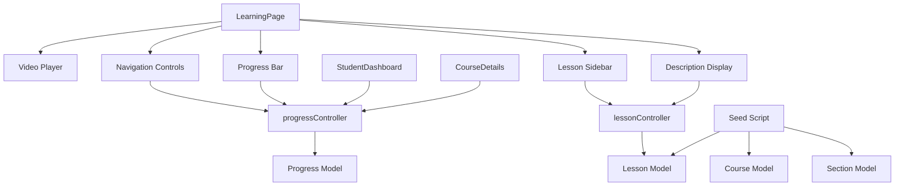
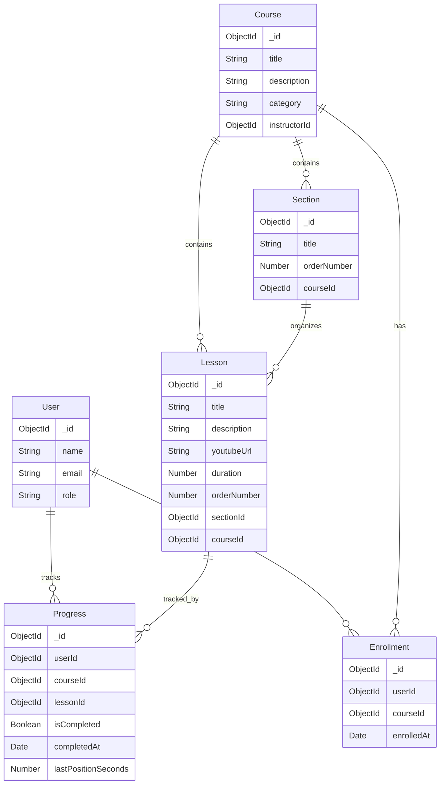

# Design Document: Enhanced Video Learning System

## Overview

This design addresses enhancements to the existing video learning system in the LMS platform. The system currently has a functional video player with AI chatbot integration, but suffers from layout issues (h-screen/overflow-hidden conflicts causing hidden navigation buttons), incomplete course content, and missing video descriptions.

The enhancement focuses on five key areas:

1. **Layout Fix**: Restructure LearningPage.jsx to use flexible layouts instead of fixed heights, ensuring navigation controls remain visible
2. **Video Navigation**: Implement Previous/Next buttons with proper state management and boundary handling
3. **Video Descriptions**: Display lesson descriptions below the video player with fallback messaging
4. **Content Completeness**: Seed database with 20+ videos per category (7 categories total) with meaningful descriptions
5. **Progress Tracking**: Enhance progress calculation and display across dashboard and course details pages

The design maintains the existing architecture (Express/MongoDB backend, React/Vite frontend) and builds upon current models (Course, Lesson, Section, Progress, User, Enrollment).

## Architecture

### System Components

The enhanced system consists of three primary layers:

**Frontend Layer (React)**
- LearningPage.jsx: Video player interface with navigation controls
- StudentDashboard.jsx: Progress display for enrolled courses
- CourseDetails.jsx: Course overview with completion percentage
- AIChatbot.jsx: AI assistant (existing, no changes required)

**Backend Layer (Express/Node.js)**
- progressController.js: Progress calculation and persistence
- lessonController.js: Lesson retrieval with descriptions
- courseController.js: Course data with aggregated progress
- chatbotController.js: AI assistant integration (existing)

**Data Layer (MongoDB Atlas)**
- Progress collection: Lesson completion tracking
- Lesson collection: Video metadata with descriptions
- Course collection: Course metadata
- Section collection: Course organization
- Enrollment collection: Student-course relationships

### Component Interactions



### Data Flow

1. **Video Navigation Flow**:
   - User clicks Next/Previous button
   - LearningPage updates currentLesson state
   - New video loads with description
   - Progress tracking initializes for new lesson

2. **Progress Tracking Flow**:
   - User marks lesson complete
   - POST /api/progress/complete
   - Progress model updates (isCompleted: true, completedAt: timestamp)
   - Frontend recalculates percentage: (completed / total) × 100
   - Dashboard and course details reflect updated progress

3. **Description Display Flow**:
   - Lesson loads in video player
   - Description fetched from lesson.description field
   - If empty, display "No description available"
   - Updates on lesson navigation

## Components and Interfaces

### Frontend Components

#### LearningPage.jsx Modifications

**Layout Structure Change**:
```javascript
// OLD (problematic):
<div className="h-screen overflow-hidden">
  <div className="h-full overflow-y-auto">
    // Content that hides buttons
  </div>
</div>

// NEW (flexible):
<div className="flex min-h-screen">
  <div className="flex-1 flex flex-col">
    // Video and controls always visible
  </div>
  <div className="w-96 overflow-y-auto">
    // Sidebar with lessons
  </div>
</div>
```

**Navigation Controls Component**:
```javascript
const NavigationControls = ({ 
  onPrevious, 
  onNext, 
  hasPrevious, 
  hasNext 
}) => (
  <div className="flex gap-3">
    <button
      onClick={onPrevious}
      disabled={!hasPrevious}
      className="bg-gray-600 text-white px-6 py-3 rounded-lg disabled:opacity-50"
    >
      Previous
    </button>
    <button
      onClick={onNext}
      disabled={!hasNext}
      className="bg-blue-600 text-white px-6 py-3 rounded-lg disabled:opacity-50"
    >
      Next
    </button>
  </div>
);
```

**Description Display Component**:
```javascript
const VideoDescription = ({ description }) => (
  <div className="bg-white p-6 border-b">
    <h3 className="text-lg font-semibold mb-3">About This Video</h3>
    <div className="text-gray-700 leading-relaxed">
      {description ? (
        <p className="whitespace-pre-wrap">{description}</p>
      ) : (
        <p className="text-gray-500 italic">
          No description available for this lesson.
        </p>
      )}
    </div>
  </div>
);
```

**State Management**:
```javascript
const [currentLesson, setCurrentLesson] = useState(null);
const [lessons, setLessons] = useState([]);
const [completedLessons, setCompletedLessons] = useState([]);
const [progress, setProgress] = useState(0);

// Navigation handlers
const handleNext = () => {
  const currentIndex = lessons.findIndex(l => l._id === currentLesson._id);
  if (currentIndex < lessons.length - 1) {
    setCurrentLesson(lessons[currentIndex + 1]);
  }
};

const handlePrevious = () => {
  const currentIndex = lessons.findIndex(l => l._id === currentLesson._id);
  if (currentIndex > 0) {
    setCurrentLesson(lessons[currentIndex - 1]);
  }
};
```

#### StudentDashboard.jsx Modifications

**Progress Display Enhancement**:
```javascript
const CourseProgressCard = ({ course, progress }) => (
  <div className="bg-white rounded-lg shadow p-6">
    <h3 className="text-xl font-bold mb-2">{course.title}</h3>
    <div className="flex items-center justify-between mb-2">
      <span className="text-sm font-medium">Progress</span>
      <span className="text-sm font-medium text-blue-600">
        {progress.progressPercentage}%
      </span>
    </div>
    <div className="w-full bg-gray-200 rounded-full h-3">
      <div
        className="bg-blue-600 h-3 rounded-full transition-all"
        style={{ width: `${progress.progressPercentage}%` }}
      />
    </div>
    <p className="text-xs text-gray-500 mt-2">
      {progress.completedLessons} of {progress.totalLessons} lessons completed
    </p>
  </div>
);
```

### Backend API Endpoints

#### Progress Controller Enhancements

**GET /api/progress/:courseId**
- Returns: `{ totalLessons, completedLessons, progressPercentage, completedLessonIds, progressData }`
- Calculation: `Math.round((completedLessons / totalLessons) * 100)`
- Used by: LearningPage, StudentDashboard, CourseDetails

**POST /api/progress/complete**
- Body: `{ courseId, lessonId }`
- Updates: `{ isCompleted: true, completedAt: Date.now(), status: 'completed' }`
- Returns: Updated progress document
- Triggers: Progress recalculation on frontend

**POST /api/progress/update**
- Body: `{ courseId, lessonId, lastPositionSeconds }`
- Updates: Video timestamp for resume functionality
- Frequency: Every 10 seconds during video playback

#### Lesson Controller

**GET /api/lessons/:courseId**
- Returns: Array of lessons with descriptions
- Sorted by: orderNumber
- Includes: title, description, youtubeUrl, duration, sectionId

### Database Seed Script

**Content Requirements**:
- 7 categories: JavaScript, React, Python, Web Design, Data Science, Business, Marketing
- 20+ videos per category
- Each video must have: title, description (100-200 words), youtubeUrl, duration

**Seed Structure**:
```javascript
const seedData = {
  javascript: {
    sections: [
      { title: 'JavaScript Fundamentals', lessons: [...] },
      { title: 'Advanced JavaScript', lessons: [...] },
      { title: 'ES6+ Features', lessons: [...] }
    ]
  },
  // ... other categories
};

// Each lesson:
{
  title: 'Introduction to Variables',
  description: 'Learn about JavaScript variables including var, let, and const. Understand scope, hoisting, and best practices for variable declaration.',
  youtubeUrl: 'https://youtube.com/watch?v=...',
  duration: 15,
  orderNumber: 1
}
```

## Data Models

### Existing Models (No Changes Required)

**Progress Model**:
```javascript
{
  userId: ObjectId,
  courseId: ObjectId,
  lessonId: ObjectId,
  status: enum['not_started', 'in_progress', 'completed'],
  lastPositionSeconds: Number,
  isCompleted: Boolean,
  completedAt: Date,
  lastWatchedAt: Date,
  timestamps: true
}
```

**Lesson Model**:
```javascript
{
  title: String (required),
  orderNumber: Number (required),
  youtubeUrl: String (required),
  duration: Number (default: 0),
  description: String (default: ''),  // Enhanced with seed data
  sectionId: ObjectId (required),
  courseId: ObjectId (required),
  createdAt: Date
}
```

**Course Model**:
```javascript
{
  title: String (required),
  description: String (required),
  thumbnail: String,
  category: enum['Programming', 'Design', 'Business', 'Marketing', 'Data Science', 'Other'],
  instructorId: ObjectId,
  totalDuration: Number,
  averageRating: Number,
  totalReviews: Number,
  createdAt: Date
}
```

### Data Relationships




## Correctness Properties

A property is a characteristic or behavior that should hold true across all valid executions of a system—essentially, a formal statement about what the system should do. Properties serve as the bridge between human-readable specifications and machine-verifiable correctness guarantees.

### Property 1: First Video Disables Previous Button

For any course with lessons, when a student is viewing the first lesson (orderNumber = 1 or index = 0), the Previous navigation button should be disabled.

**Validates: Requirements 1.2**

### Property 2: Last Video Disables Next Button

For any course with lessons, when a student is viewing the last lesson (index = lessons.length - 1), the Next navigation button should be disabled.

**Validates: Requirements 1.3**

### Property 3: Next Button Advances to Sequential Lesson

For any lesson that is not the last lesson in a course, clicking the Next button should load the lesson at currentIndex + 1 in the ordered lesson array.

**Validates: Requirements 1.4**

### Property 4: Previous Button Returns to Sequential Lesson

For any lesson that is not the first lesson in a course, clicking the Previous button should load the lesson at currentIndex - 1 in the ordered lesson array.

**Validates: Requirements 1.5**

### Property 5: Description Updates on Navigation

For any video navigation event (Next, Previous, or direct selection), the displayed description should match the description field of the newly loaded lesson.

**Validates: Requirements 2.4**

### Property 6: All Lessons Have Non-Empty Descriptions

For all lessons in the course catalog across all categories, each lesson document should have a description field that is non-null and non-empty (length > 0).

**Validates: Requirements 3.8**

### Property 7: Progress Percentage Calculation Accuracy

For any course and any student's progress state, the displayed completion percentage should equal Math.round((completedLessons / totalLessons) × 100), where completedLessons is the count of lessons with isCompleted = true.

**Validates: Requirements 4.1**

### Property 8: Progress Percentage Rounding

For any calculated progress percentage, the displayed value should be rounded to the nearest whole number (no decimal places).

**Validates: Requirements 4.6**

### Property 9: Progress Updates After Completion

For any lesson completion event, the course completion percentage should be recalculated and updated in the UI within a reasonable time frame (< 5 seconds).

**Validates: Requirements 4.4**

### Property 10: AI Questions Sent to API

For any text input submitted through the AI Assistant, the system should make an HTTP request to the Hugging Face API with the question text.

**Validates: Requirements 5.2**

### Property 11: AI Responses Displayed

For any successful API response from Hugging Face, the AI Assistant should display the response text to the student in the chat interface.

**Validates: Requirements 5.3**

### Property 12: AI Error Handling

For any failed API request to Hugging Face (network error, timeout, 503, etc.), the AI Assistant should display an error message to the student rather than failing silently.

**Validates: Requirements 5.4**

### Property 13: Flexible Lesson Access

For any lesson in a course that a student is enrolled in, the student should be able to select and load that lesson regardless of which other lessons have been completed (no sequential access restrictions).

**Validates: Requirements 6.1, 6.2, 6.3**

### Property 14: Progress Tracks Non-Sequential Completion

For any lesson completion event, the progress tracker should record the completion (isCompleted = true, completedAt = timestamp) regardless of whether previous lessons in the sequence have been completed.

**Validates: Requirements 6.4**

### Property 15: Completion Persistence

For any lesson marked as complete, the completion status should be persisted to the MongoDB Progress collection within a reasonable time frame (< 60 seconds).

**Validates: Requirements 7.3**

### Property 16: Progress Persistence Round-Trip

For any student's progress data, if the student logs out and logs back in (simulating a different device), the loaded progress data should match the previously saved progress data (same completed lessons, same percentages).

**Validates: Requirements 7.4**

### Property 17: Multi-Course Progress Isolation

For any student enrolled in multiple courses, progress data for each course should be maintained independently—completing lessons in one course should not affect progress calculations for other courses.

**Validates: Requirements 7.5**

## Error Handling

### Frontend Error Handling

**Video Loading Errors**:
- Invalid YouTube URLs: Display error message "Unable to load video. Please contact support."
- Network failures: Show retry button with "Failed to load video. Click to retry."
- Missing lesson data: Redirect to course page with toast notification

**Navigation Errors**:
- Boundary violations (clicking Next on last video): Disable button to prevent action
- Invalid lesson IDs: Log error and load first available lesson
- State desynchronization: Refresh lesson list from server

**Progress Tracking Errors**:
- Failed completion save: Show toast "Failed to save progress. Please try again." with retry button
- Network timeout: Queue completion for retry on next successful request
- Optimistic UI updates: Update UI immediately, rollback on server error

**AI Assistant Errors**:
- API timeout (> 10 seconds): Display "Request timed out. Please try a shorter question."
- Model loading (503): Display "AI model is loading. Please wait 30 seconds and try again."
- Rate limiting (429): Display "Too many requests. Please wait a moment."
- Network errors: Display "Connection error. Please check your internet."

### Backend Error Handling

**Progress Controller Errors**:
```javascript
// Enrollment verification
if (!enrollment) {
  return res.status(403).json({ 
    message: 'Not enrolled in this course',
    code: 'NOT_ENROLLED'
  });
}

// Database errors
try {
  await Progress.findOneAndUpdate(...);
} catch (error) {
  console.error('Progress update failed:', error);
  return res.status(500).json({ 
    message: 'Failed to update progress',
    code: 'DB_ERROR'
  });
}
```

**Lesson Controller Errors**:
```javascript
// Missing course
if (!course) {
  return res.status(404).json({ 
    message: 'Course not found',
    code: 'COURSE_NOT_FOUND'
  });
}

// Empty lesson list
if (lessons.length === 0) {
  return res.status(200).json({ 
    lessons: [],
    message: 'No lessons available'
  });
}
```

**AI Chatbot Controller Errors**:
```javascript
// API timeout handling
const controller = new AbortController();
const timeout = setTimeout(() => controller.abort(), 10000);

try {
  const response = await fetch(API_URL, { 
    signal: controller.signal 
  });
} catch (error) {
  if (error.name === 'AbortError') {
    return res.status(408).json({ 
      message: 'Request timeout',
      code: 'TIMEOUT'
    });
  }
}
```

### Database Error Handling

**Connection Failures**:
- Implement connection retry logic with exponential backoff
- Display maintenance message if database unavailable for > 30 seconds
- Log all connection errors for monitoring

**Validation Errors**:
- Mongoose validation failures: Return 400 with specific field errors
- Duplicate key errors: Return 409 with conflict message
- Cast errors (invalid ObjectId): Return 400 with "Invalid ID format"

**Transaction Failures**:
- Progress updates: Retry once on failure, then return error
- Bulk operations: Log failed items, continue with successful ones
- Atomic operations: Use findOneAndUpdate with upsert for idempotency

## Testing Strategy

### Dual Testing Approach

This feature requires both unit tests and property-based tests for comprehensive coverage:

**Unit Tests**: Verify specific examples, edge cases, and integration points
- Specific UI rendering scenarios (buttons visible, descriptions displayed)
- Database query results for specific courses
- API integration with mocked responses
- Error handling for specific failure modes

**Property-Based Tests**: Verify universal properties across all inputs
- Navigation behavior across randomly generated lesson lists
- Progress calculation across random completion states
- Description synchronization across random navigation sequences
- Access control across random enrollment scenarios

Both testing approaches are complementary and necessary. Unit tests catch concrete bugs in specific scenarios, while property tests verify general correctness across the input space.

### Property-Based Testing Configuration

**Library Selection**: 
- Frontend (React): Use `fast-check` for JavaScript property-based testing
- Backend (Node.js): Use `fast-check` for API and controller testing

**Test Configuration**:
- Minimum 100 iterations per property test (due to randomization)
- Each property test must reference its design document property
- Tag format: `// Feature: enhanced-video-learning-system, Property {number}: {property_text}`

**Example Property Test Structure**:
```javascript
// Feature: enhanced-video-learning-system, Property 1: First Video Disables Previous Button
test('First video disables Previous button', () => {
  fc.assert(
    fc.property(
      fc.array(fc.object({ /* lesson generator */ }), { minLength: 1 }),
      (lessons) => {
        const { getByRole } = render(
          <LearningPage lessons={lessons} currentIndex={0} />
        );
        const prevButton = getByRole('button', { name: /previous/i });
        expect(prevButton).toBeDisabled();
      }
    ),
    { numRuns: 100 }
  );
});
```

### Unit Testing Strategy

**Frontend Component Tests** (React Testing Library + Vitest):

1. **LearningPage.jsx**:
   - Navigation buttons are visible in viewport (Property 1 example)
   - Description section renders below video player (Property 2.1 example)
   - Empty description shows fallback message (edge case)
   - Progress bar displays correct percentage (specific example)
   - Lesson sidebar shows all sections and lessons
   - Mark Complete button updates state correctly

2. **StudentDashboard.jsx**:
   - Progress percentage displays for each enrolled course (Property 4.2 example)
   - Progress bars render with correct widths
   - Course cards show completed/total lesson counts

3. **CourseDetails.jsx**:
   - Progress percentage displays on course details page (Property 4.3 example)
   - Enrollment status affects displayed information

**Backend API Tests** (Jest + Supertest):

1. **Progress Controller**:
   - GET /api/progress/:courseId returns correct calculation
   - POST /api/progress/complete updates database (Property 7.1 example)
   - POST /api/progress/update saves video timestamp
   - Error handling for non-enrolled students
   - Error handling for invalid lesson IDs

2. **Lesson Controller**:
   - GET /api/lessons/:courseId returns lessons with descriptions
   - Lessons sorted by orderNumber
   - Empty course returns empty array

3. **Chatbot Controller**:
   - POST /api/chatbot/ask sends request to Hugging Face (Property 5.5 example)
   - AI Assistant accessible on learning page (Property 5.6 example)
   - Timeout handling for slow API responses
   - Error message display for API failures

**Database Tests** (MongoDB Memory Server):

1. **Seed Data Verification**:
   - JavaScript course has >= 20 lessons (Property 3.1 example)
   - React course has >= 20 lessons (Property 3.2 example)
   - Python course has >= 20 lessons (Property 3.3 example)
   - Web Design course has >= 20 lessons (Property 3.4 example)
   - Data Science course has >= 20 lessons (Property 3.5 example)
   - Business course has >= 20 lessons (Property 3.6 example)
   - Marketing course has >= 20 lessons (Property 3.7 example)

2. **Progress Model**:
   - Unique index prevents duplicate progress entries
   - Timestamps update correctly
   - Completion date set when isCompleted = true

### Property-Based Testing Strategy

**Navigation Properties** (fast-check):

1. **Property 1: First Video Disables Previous Button**:
   - Generator: Random course with 1-50 lessons
   - Test: When currentIndex = 0, Previous button is disabled
   - Iterations: 100

2. **Property 2: Last Video Disables Next Button**:
   - Generator: Random course with 1-50 lessons
   - Test: When currentIndex = lessons.length - 1, Next button is disabled
   - Iterations: 100

3. **Property 3: Next Button Advances to Sequential Lesson**:
   - Generator: Random course with 2-50 lessons, random currentIndex (not last)
   - Test: After clicking Next, currentLesson = lessons[oldIndex + 1]
   - Iterations: 100

4. **Property 4: Previous Button Returns to Sequential Lesson**:
   - Generator: Random course with 2-50 lessons, random currentIndex (not first)
   - Test: After clicking Previous, currentLesson = lessons[oldIndex - 1]
   - Iterations: 100

5. **Property 5: Description Updates on Navigation**:
   - Generator: Random course with lessons, random navigation sequence
   - Test: After each navigation, displayed description = currentLesson.description
   - Iterations: 100

**Data Properties** (fast-check):

6. **Property 6: All Lessons Have Non-Empty Descriptions**:
   - Generator: Query all lessons from database
   - Test: For each lesson, description !== null && description.length > 0
   - Iterations: 1 (database query)

**Progress Properties** (fast-check):

7. **Property 7: Progress Percentage Calculation Accuracy**:
   - Generator: Random course with 1-100 lessons, random completion state (0-100% completed)
   - Test: displayedPercentage = Math.round((completed / total) × 100)
   - Iterations: 100

8. **Property 8: Progress Percentage Rounding**:
   - Generator: Random completion ratios that produce decimals (e.g., 1/3, 2/7)
   - Test: displayedPercentage is integer (no decimal places)
   - Iterations: 100

9. **Property 9: Progress Updates After Completion**:
   - Generator: Random course, random lesson to complete
   - Test: After completion, new percentage reflects additional completed lesson
   - Iterations: 100

**AI Assistant Properties** (fast-check):

10. **Property 10: AI Questions Sent to API**:
    - Generator: Random text strings (questions)
    - Test: For each question, verify API request made with question text
    - Iterations: 100

11. **Property 11: AI Responses Displayed**:
    - Generator: Random API responses
    - Test: For each response, verify it appears in chat interface
    - Iterations: 100

12. **Property 12: AI Error Handling**:
    - Generator: Random API error types (timeout, 503, network error)
    - Test: For each error, verify error message displayed
    - Iterations: 100

**Access Control Properties** (fast-check):

13. **Property 13: Flexible Lesson Access**:
    - Generator: Random course, random lesson selection, random completion state
    - Test: Any lesson can be loaded regardless of completion order
    - Iterations: 100

14. **Property 14: Progress Tracks Non-Sequential Completion**:
    - Generator: Random course, random non-sequential lesson completion order
    - Test: All completions recorded correctly regardless of order
    - Iterations: 100

**Persistence Properties** (fast-check):

15. **Property 15: Completion Persistence**:
    - Generator: Random lesson completions
    - Test: For each completion, verify Progress document created/updated in database
    - Iterations: 100

16. **Property 16: Progress Persistence Round-Trip**:
    - Generator: Random progress state (multiple courses, various completion levels)
    - Test: Save progress, clear session, load progress → should match original
    - Iterations: 100

17. **Property 17: Multi-Course Progress Isolation**:
    - Generator: Random student with 2-10 enrolled courses, random completions in each
    - Test: Progress for each course calculated independently
    - Iterations: 100

### Integration Testing

**End-to-End Scenarios** (Playwright or Cypress):

1. **Complete Learning Flow**:
   - Student enrolls in course
   - Navigates through lessons using Next/Previous
   - Marks lessons complete
   - Verifies progress updates on dashboard
   - Logs out and back in, progress persists

2. **AI Assistant Flow**:
   - Student opens chatbot
   - Asks question
   - Receives response
   - Handles error gracefully when API fails

3. **Flexible Access Flow**:
   - Student jumps to middle lesson
   - Completes it
   - Jumps to first lesson
   - Verifies both completions recorded

### Test Coverage Goals

- Unit test coverage: > 80% for all modified files
- Property test coverage: 100% of correctness properties
- Integration test coverage: All critical user flows
- Edge case coverage: Empty descriptions, boundary navigation, API failures

### Continuous Testing

- Run unit tests on every commit (pre-commit hook)
- Run property tests on every pull request
- Run integration tests nightly
- Monitor test execution time (property tests may be slower due to 100 iterations)
